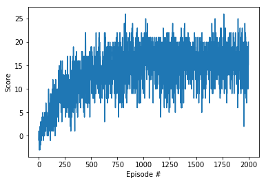

### RL Algorithm
Here I use DQN algorithm to train the agent. 

By looking at the Agent.learn() function we can see that there are two Q-networks, one is local Q-network and one is target Q-network, which implies an off-policy method. 

Here I use Neural Network architecture described as follows:
37 * 64 * 64 * 4.
The input layer has the same dimensions as the state vector, followed by 2 hidden layers with 64 neurons, and output layer of 4 neurons. Here the output layer returns probabilities vector instead of softmax result. For activation we use RELU, for loss function we use MSE and for optimizer we use Adam.

For training i've used the folowing hyperparameters:

* EPSILON_START = 1.0
* EPSILON_END = 0.001
* EPISOLON_DECAY = 0.995

We train the agent for at most 2000 episodes. The training process stops one the agent reaches 15 points on average. The agent would interact with the environment for 1000 times for each episode. The epsilon starts at 1 and would decay as the training process coontinues with decay rate 0.995. We set the minimum epsilon to be 0.01 to make sure the algorithm would continuously do exploration. 

### Result

First I set the target to average score of +15 and save the model weights to file checkpoint15.pth . Then I set the target to average score of +20 to generate the result plot shown above. 

### Future Work
It is worthwhile to try DDQN, Prioritized experience replay or Dueling DQN. Also, more complicated neural network architectures have the potential to improve the agent's performance. Pixels-based model should be tried given we have GPU on our local machine. 

### Literature
[1] <a href="https://deepmind.com/research/dqn/" target="_blank">Human-level control through deep reinforcement learning</a>

[2] <a href="https://arxiv.org/abs/1509.06461" target="_blank">Deep Reinforcement Learning with Double Q-learning</a>

[3] <a href="https://arxiv.org/abs/1710.02298" target="_blank">Rainbow: Combining Improvements in Deep Reinforcement Learning</a>
